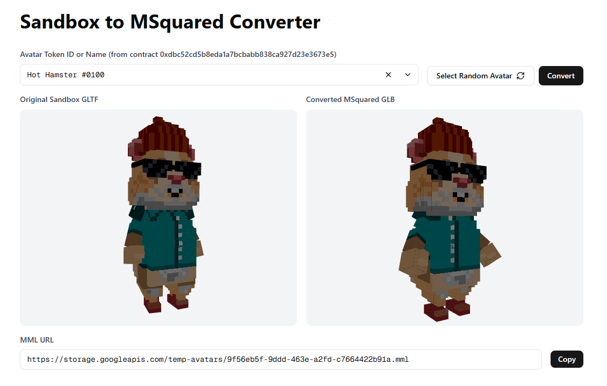

# Sandbox to MSquared Converter

A web application that converts (various types of) 3D avatars from The Sandbox format to MSquared format (MML-wrapped GLBs).



## Features

- **Avatar Conversion**: Convert Sandbox NFT avatars to MSquared-compatible format
- **3D Preview**: Real-time preview of original and converted 3D models using Three.js
- **Token Lookup**: Fetch avatars by contract address and token ID
- **Random Selection**: Browse random avatars from the collection
- **Cloud Storage**: Automatic upload of converted files to Google Cloud Storage

## How It Works

1. Enter a contract address and token ID (or search by avatar name)
2. The app fetches the original GLTF model from The Sandbox
3. Converts the model to GLB format with proper skeleton mapping
4. Generates an MML file containing the converted avatar
5. Uploads both files to cloud storage and provides download links
6. Copy the the MML url into a Morpheus Platform game client to use it

## Compatibility

**Note**: This converter is specifically designed for humanoid avatars from The Sandbox collection. Only tokens from [The Sandbox's Humanoids collection](https://opensea.io/collection/the-sandbox-s-assets?traits=%5B%7B%22traitType%22:%22Category+(level+0)%22,%22values%22:%5B%22Humanoids%22%5D%7D%5D) are good candidates for conversion.

Results may vary depending on:
- How niche the skeleton structure is (the converter accommodates the most common skeletons)
   - Please reach out if you have a model with a skeleton which isn't supported yet
- The complexity of the 3D model (some are humanoid but had various accessories to the mesh, eg. a drum kit)

## Getting Started

```bash
npm install
npm run dev
```

The app will be available at `http://localhost:3000`

## Environment Variables

Copy `env.template` to `.env` and fill in your actual values:

```bash
cp env.template .env
```

Required environment variables:
- `ALCHEMY_API_KEY` - API key for blockchain/NFT metadata services
- `GCS_BUCKET_NAME` - Google Cloud Storage bucket for file uploads
- `GOOGLE_CLOUD_CREDENTIALS` - Base64 encoded service account JSON
- `GOOGLE_CLOUD_PROJECT` - Your Google Cloud project ID

Optional:
- `HOST_DOMAIN` - Base URL for the application (defaults to `http://localhost:3000`)

## Data Files

The converter requires specific skeleton and joint mapping files located in `/public/data/`:
- `skeleton.glb` - Reference skeleton model
- `joints-map.json` - Joint mapping configuration
- `joints-remove.json` - Joints to remove during conversion
- `t-pose.json` - T-pose reference data
